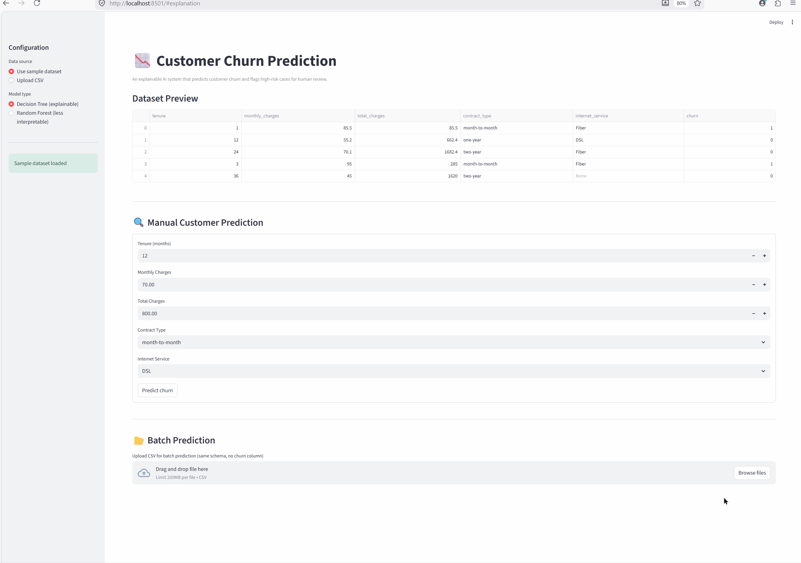
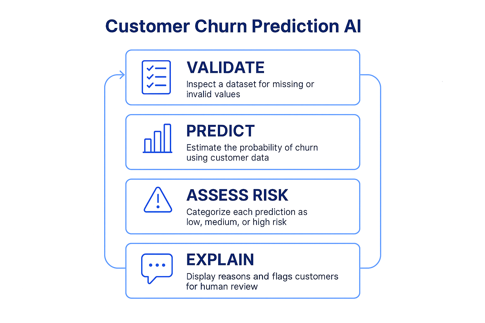
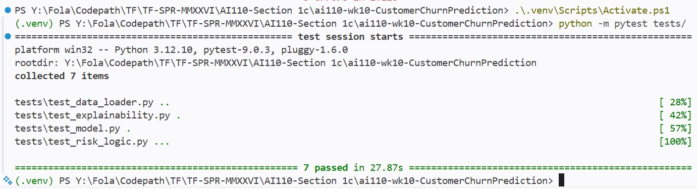

# 👉 [READ ME](readme.md) | [AI Bill of Materials (AI-BOM)](AI_Bill_of_Materials.md) | [Model Card](model_card.md) |

# Model Card – Customer Churn Prediction AI

🔹 Project Flow (High Level)
Data → Validation → Model → Prediction → Risk → Explanation → Human Decision

🧭 FULL PROJECT OVERVIEW (END‑TO‑END)

🔹 What This Project Is
An explainable AI system that predicts customer churn and guides human decision‑making, rather than replacing it.
This system predicts customer churn risk using structured customer data.
It is designed to support decision‑making, not automate it.

🔹 Elevator pitch 
This project is an explainable AI system that predicts customer churn risk using structured data and conservative machine‑learning models. Instead of automating decisions, it assesses confidence, explains its reasoning, and flags high‑risk cases for human review.

## Intended Use
- Identify customers at risk of churn
- Support retention and review workflows

## Not Intended For
- Automated customer termination
- Decisions without human oversight

## Models Used
- Decision Tree (default, explainable)
- Random Forest (optional, less interpretable)

## Inputs
Customer attributes such as tenure, charges, contract type, and internet service.

## Outputs
- Churn probability
- Risk tier (Low / Medium / High)
- Explanation (Decision Tree only)

## Performance Notes
The model is trained on small, illustrative datasets.
Predictions should be treated as advisory signals.

## Failure Modes
- Oversimplification of complex behavior
- Reduced explainability in Random Forest mode

## Test Results

## Human-in-the-Loop Triggers
- High risk tier
- Random Forest selection
- Ambiguous customer profiles

## Ethical Considerations
The system avoids demographic attributes and does not infer protected characteristics.

🔹 Configuration & Behavior
✅ Data Source

Sample dataset → safe demo, known schema
Uploaded CSV → validated before use

Why: prevents training on incorrect data.

✅ Model Type

Decision Tree (default)

- Fully explainable
- Clear decision paths
- Preferred for high‑stakes use

Random Forest (optional)

- Higher accuracy
- Lower explainability
- UI warning displayed

Why: explainability > raw accuracy.

✅ Prediction Output

- Churn Probability → numeric confidence
- Risk Tier → actionable categorization
- Explanation → “why this result happened”

Why: humans act better on categories + reasons.

✅ Risk Behavior

| Risk Tier | Behavior                |
|-----------|-------------------------|
| Low       | Informational           |
| Medium    | Review suggested        |
| High      | Human review required   |

Why: avoids unsafe automation.

✅ Batch vs Manual Prediction

Manual → individual customer review
Batch → operational analysis

Why: supports both analysts and managers.

✅ Reliability Philosophy

“When confidence is low, slow down.”

This principle shows up in:

- Defaults
- Warnings
- Tests
- Documentation

I. **Create env**
python -m venv venv
source venv/bin/activate  # Windows: venv\Scripts\activate

II. **Install deps**
pip install -r requirements.txt
pip install pandas scikit-learn pytest                      

III. **Run app locally**
streamlit run app.py

V. **How To Run Tests**
pytest tests/
pytest

